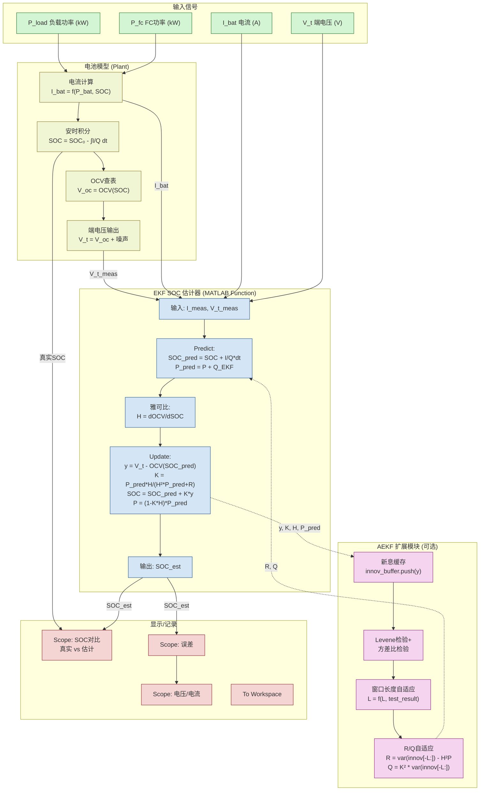

# SOC EKF Simulink 模型结构

```mermaid
flowchart TB
    subgraph Inputs["输入信号"]
        I_bat["I_bat 电流 (A)"]
        V_t["V_t 端电压 (V)"]
        P_load["P_load 负载功率 (kW)"]
        P_fc["P_fc FC功率 (kW)"]
    end

    subgraph BatteryPlant["电池模型 (Plant)"]
        direction TB
        BP1["OCV查表<br/>V_oc = OCV(SOC)"]
        BP2["电流计算<br/>I_bat = f(P_bat, SOC)"]
        BP3["安时积分<br/>SOC = SOC₀ - ∫I/Q dt"]
        BP4["端电压输出<br/>V_t = V_oc + 噪声"]
    end

    subgraph EKF_Core["EKF SOC 估计器 (MATLAB Function)"]
        direction TB
        E1["输入: I_meas, V_t_meas"]
        E2["Predict:<br/>SOC_pred = SOC + I/Q*dt<br/>P_pred = P + Q_EKF"]
        E3["雅可比:<br/>H = dOCV/dSOC"]
        E4["Update:<br/>y = V_t - OCV(SOC_pred)<br/>K = P_pred*H/(H²*P_pred+R)<br/>SOC = SOC_pred + K*y<br/>P = (1-K*H)*P_pred"]
        E5["输出: SOC_est"]
    end

    subgraph AEKF_Extension["AEKF 扩展模块 (可选)"]
        direction TB
        A1["新息缓存<br/>innov_buffer.push(y)"]
        A2["Levene检验+<br/>方差比检验"]
        A3["窗口长度自适应<br/>L = f(L, test_result)"]
        A4["R/Q自适应<br/>R = var(innov[-L:]) - H²P<br/>Q = K² * var(innov[-L:])"]
    end

    subgraph Display["显示/记录"]
        S1["Scope: SOC对比<br/>真实 vs 估计"]
        S2["Scope: 误差"]
        S3["Scope: 电压/电流"]
        S4["To Workspace"]
    end

    P_load --> BP2
    P_fc --> BP2
    BP2 --> BP3
    BP3 --> BP1
    BP1 --> BP4
    BP3 -->|真实SOC| S1

    BP4 -->|V_t_meas| E1
    BP2 -->|I_bat| E1
    I_bat --> E1
    V_t --> E1

    E1 --> E2 --> E3 --> E4 --> E5
    E4 -.->|y, K, H, P_pred| A1
    A1 --> A2 --> A3 --> A4
    A4 -.->|R, Q| E2

    E5 -->|SOC_est| S1
    E5 -->|SOC_est| S2
    S2 --> S3

    classDef input fill:#d4f5d4,stroke:#2d7d2d
    classDef plant fill:#f0f5d4,stroke:#8d7d2d
    classDef ekf fill:#d4e5f5,stroke:#2d5d8d
    classDef aekf fill:#f5d4f0,stroke:#8d2d7d
    classDef display fill:#f5d4d4,stroke:#8d2d2d

    class I_bat,V_t,P_load,P_fc input
    class BP1,BP2,BP3,BP4 plant
    class E1,E2,E3,E4,E5 ekf
    class A1,A2,A3,A4 aekf
    class S1,S2,S3,S4 display
```
